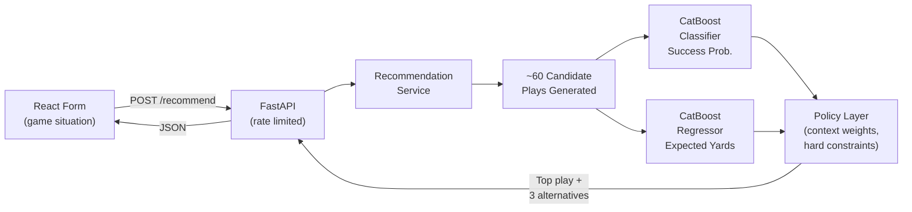

# Chicago Bears Playcalling Engine


> A full-stack ML system that recommends NFL play calls for the Chicago Bears in real time, driven by two CatBoost models trained on 2025 play-by-play data.

**[Live Demo →](https://playcalling-engine-bears.vercel.app)**


---

## How It Works



Each request generates ~60 candidate plays (runs × formations × locations × gaps × ball carriers; passes × formations × locations × depths), scores them through both models, then applies a context-aware policy layer that adjusts weights for down-and-distance, red zone, two-minute drill, and late-game scenarios before selecting the best play.

---

## ML Models

Both models are trained on 2025 Chicago Bears offensive play-by-play data via `nflreadpy`, split by `game_id` to prevent data leakage.

| Model | Algorithm | Task | Eval Metric |
|-------|-----------|------|-------------|
| Success Classifier | CatBoostClassifier | Binary — did the play meet the down-specific yardage threshold? | AUC |
| Yards Regressor | CatBoostRegressor (Quantile) | Continuous — how many yards does this play gain? | MAE / RMSE |

**Success thresholds by down:**
- 1st down — gain ≥ 40% of yards to go
- 2nd down — gain ≥ 60% of yards to go
- 3rd / 4th down — full conversion

> To see validation metrics, run `python backend/ml/training/train.py` and check the printed AUC, MAE, and RMSE output.

---

## Running Locally

### Backend
```bash
pip install -r requirements.txt
uvicorn backend.app.main:app --reload
# API available at http://localhost:8000
```

### Frontend
```bash
cd frontend/my-vite-app
npm install
npm run dev
# UI available at http://localhost:5173
```

Set `VITE_API_BASE=http://localhost:8000` (default) or point to your deployed backend.

---

## API

### `POST /recommend`

**Request:**
```json
{
  "down": 3,
  "distance": 7,
  "fieldPosition": 65,
  "quarter": 4,
  "timeRemaining": "02:30",
  "scoreDifference": -3,
  "opponent": "GB",
  "posteam_timeouts_remaining": 2,
  "defteam_timeouts_remaining": 1
}
```

**Response:**
```json
{
  "best_play": {
    "type": "pass",
    "shotgun": "shotgun",
    "pass_location": "middle",
    "pass_depth_bucket": "short",
    "success_prob": 0.61,
    "expected_yards": 8.2,
    "risk_level": "medium",
    "reasoning": "3rd & 7 — weighting heavily toward conversion. Short middle concept balances success probability with yards needed."
  },
  "alternatives": [...]
}
```

### `GET /health`
```json
{ "ok": true }
```

Rate limit: **60 requests / minute** per IP.

---

## Project Structure

```
backend/
  app/
    main.py               FastAPI app, CORS, rate limiting, lifespan model loading
    api/routes/           Endpoint handlers
    services/             recommendation_service.py, policy_layer.py
    core/
  ml/
    features/             build_features.py — ETL from nflreadpy
    training/             train.py — CatBoost model training
    artifacts/            Serialized model files (.pkl)
frontend/
  my-vite-app/
    src/
      components/         GameSituationForm, BestPlayRecommendation
      services/           apiService.ts
      types.ts
HealthCheck/
  ping.py                 GitHub Actions health ping (prevents Render cold starts)
```

---

## Tech Stack

| Layer | Technology |
|-------|-----------|
| Frontend | React 19, TypeScript (strict), Vite, React Router |
| Backend | Python, FastAPI, slowapi (rate limiting) |
| ML | CatBoost, scikit-learn, pandas, nflreadpy |
| Deployment | Vercel (frontend), Render (backend) |
| CI | GitHub Actions (health check every 5 min) |

---

## License

MIT
